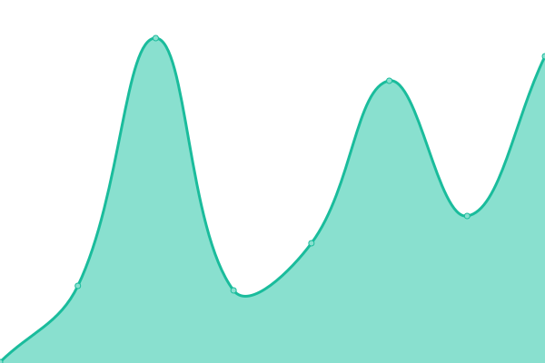

# [📈 Live Status](https://demo.upptime.js.org): <!--live status--> **🟧 Partial outage**

This repository contains the open-source uptime monitor and status page for [Joshua Eason](https://demo.upptime.js.org), powered by [Upptime](https://github.com/upptime/upptime).

With [Upptime](https://upptime.js.org), you can get your own unlimited and free uptime monitor and status page, powered entirely by a GitHub repository. We use [Issues](https://github.com/jeason81/upptime/issues) as incident reports, [Actions](https://github.com/jeason81/upptime/actions) as uptime monitors, and [Pages](https://demo.upptime.js.org) for the status page.

<!--start: status pages-->
<!-- This summary is generated by Upptime (https://github.com/upptime/upptime) -->
<!-- Do not edit this manually, your changes will be overwritten -->
<!-- prettier-ignore -->
| URL | Status | History | Response Time | Uptime |
| --- | ------ | ------- | ------------- | ------ |
|  [Google](https://www.google.com) | 🟩 Up | [google.yml](https://github.com/jeason81/upptime/commits/HEAD/history/google.yml) | 

 62ms
     
 | 

<a href="https://jeason81.github.io/upptime/history/google">100.00%</a>
    

|  [Ironbank](https://ironbank.dso.mil) | 🟩 Up | [ironbank.yml](https://github.com/jeason81/upptime/commits/HEAD/history/ironbank.yml) | 

 1167ms
     
 | 

<a href="https://jeason81.github.io/upptime/history/ironbank">99.22%</a>
    

|  [Repo1](https://repo1.dso.mil/api/v4/version) | 🟥 Down | [repo1.yml](https://github.com/jeason81/upptime/commits/HEAD/history/repo1.yml) | 

 834ms
     
 | 

<a href="https://jeason81.github.io/upptime/history/repo1">100.00%</a>
    

|  [Registry1](https://registry1.dso.mil) | 🟩 Up | [registry1.yml](https://github.com/jeason81/upptime/commits/HEAD/history/registry1.yml) | 

 645ms
     
 | 

<a href="https://jeason81.github.io/upptime/history/registry1">100.00%</a>
    

<!--end: status pages-->

[**Visit our status website →**](https://demo.upptime.js.org)

## 📄 License

- Powered by: [Upptime](https://github.com/upptime/upptime)
- Code: [MIT](./LICENSE) © [Joshua Eason](https://demo.upptime.js.org)
- Data in the `./history` directory: [Open Database License](https://opendatacommons.org/licenses/odbl/1-0/)
